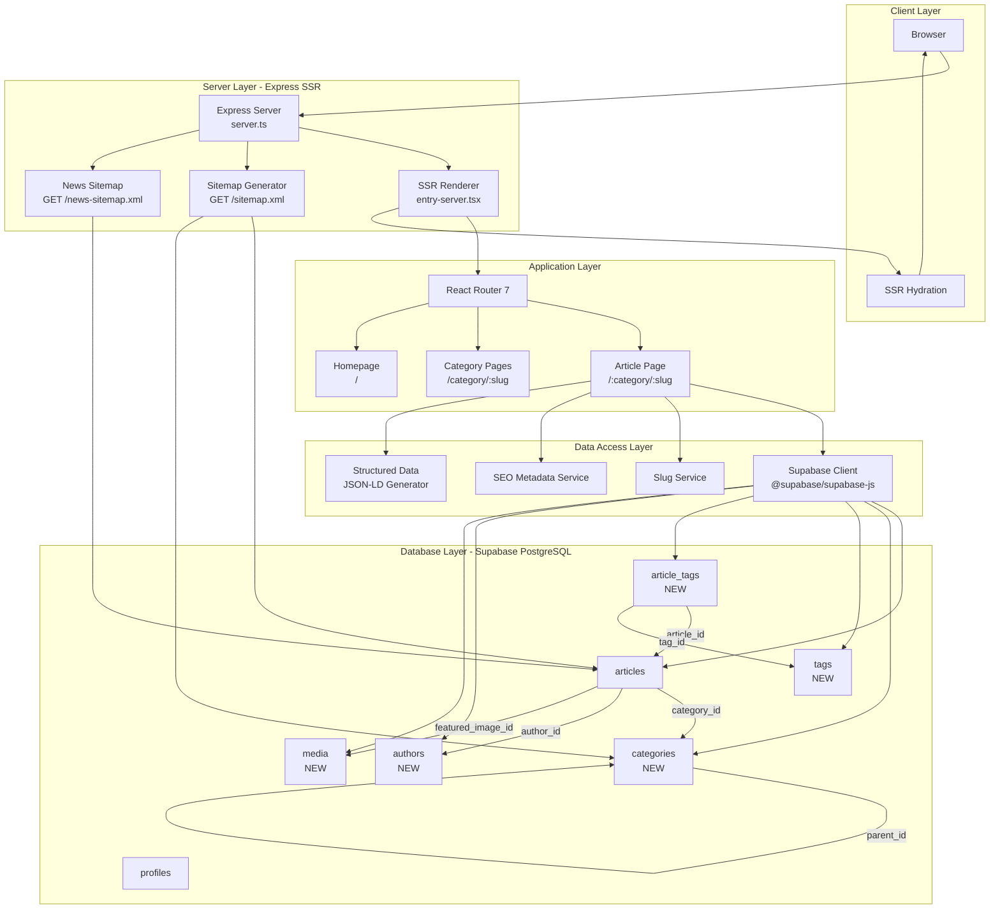
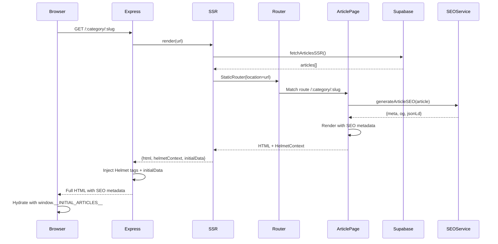

# Design Document: Phase 1 - SEO & Core Article System

## Overview

Phase 1 establishes the foundational SEO and article infrastructure for Lensa Insignia, a news publishing platform. The design focuses on five critical high-priority features: complete database schema with hierarchical categories and tags, dynamic XML sitemap generation, individual article pages with proper routing, SEO-friendly URL slugs, and comprehensive structured data implementation using Schema.org JSON-LD markup.

The system builds upon an existing React 18 + TypeScript + Vite + Supabase stack with partial SSR implementation (Express + entry-server.tsx). The design prioritizes search engine discoverability, semantic URL structure, and proper SEO metadata injection while maintaining compatibility with the current RBAC system (admin, dev, poster, user roles).

**Success Criteria**: Articles discoverable by search engines within 24 hours, complete SEO metadata on first paint, clean semantic URLs, hierarchical category support, automatic sitemap updates, and full Schema.org markup for NewsArticle, Organization, and BreadcrumbList.

## Architecture



## Main Workflow Sequence



## Components and Interfaces

### Component 1: Enhanced Database Schema

**Purpose**: Extend existing database to support hierarchical categories, many-to-many tag relationships, dedicated authors table, and proper media management.

**Responsibilities**:
- Store hierarchical category structure with parent-child relationships
- Enable many-to-many article-tag associations
- Separate author data from user profiles
- Centralize media asset management
- Maintain backward compatibility with existing articles table

### Component 2: Slug Generation Service

**Purpose**: Generate and manage SEO-friendly URL slugs for articles with conflict resolution.

**Interface**:
```typescript
interface SlugService {
  generateSlug(title: string): string
  ensureUniqueSlug(slug: string, categoryId: string, articleId?: string): Promise<string>
  findArticleBySlug(categorySlug: string, articleSlug: string): Promise<Article | null>
}
```

**Responsibilities**:
- Convert article titles to URL-safe slugs (lowercase, hyphens, no special chars)
- Ensure slug uniqueness within category scope
- Handle slug conflicts with numeric suffixes (-2, -3, etc.)
- Provide slug-based article lookup for routing

### Component 3: Article Page Component

**Purpose**: Render individual article pages with full content, related articles, and complete SEO metadata.

**Interface**:
```typescript
interface ArticlePageProps {
  // Populated via SSR or client-side fetch
}

interface ArticlePageState {
  article: Article | null
  relatedArticles: Article[]
  loading: boolean
  error: string | null
}
```

**Responsibilities**:
- Parse /:category/:slug route parameters
- Fetch article by category slug + article slug
- Render article content (contentStr markdown or contentArr)
- Display related articles (same category, similar tags)
- Generate and inject complete SEO metadata
- Handle 404 for non-existent articles

### Component 4: Sitemap Generator

**Purpose**: Generate dynamic XML sitemaps updated automatically when content changes.

**Interface**:
```typescript
interface SitemapGenerator {
  generateMainSitemap(): Promise<string>
  generateNewsSitemap(): Promise<string>
  getSitemapEntries(): Promise<SitemapEntry[]>
}

interface SitemapEntry {
  loc: string
  lastmod?: string
  priority?: number
  changefreq?: 'always' | 'hourly' | 'daily' | 'weekly' | 'monthly' | 'yearly' | 'never'
}
```

**Responsibilities**:
- Generate XML sitemap with all published articles
- Include category pages, static pages, author pages
- Provide separate news sitemap (last 48 hours only)
- Update automatically via endpoint (no cron needed)
- Handle sitemap errors gracefully with fallback

### Component 5: SEO Metadata Service

**Purpose**: Generate comprehensive SEO metadata for all page types.

**Interface**:
```typescript
interface SEOMetadataService {
  generateArticleSEO(article: Article): SEOMetadata
  generateCategorySEO(category: Category): SEOMetadata
  generateHomepageSEO(): SEOMetadata
}

interface SEOMetadata {
  title: string
  description: string
  canonical: string
  openGraph: OpenGraphData
  twitter: TwitterCardData
  structuredData: object[]
}
```

**Responsibilities**:
- Generate meta title, description, canonical URLs
- Create Open Graph metadata for social sharing
- Build Twitter Card metadata
- Generate Schema.org JSON-LD structured data
- Handle missing data gracefully with fallbacks

### Component 6: Structured Data Service

**Purpose**: Generate Schema.org JSON-LD markup for enhanced search engine understanding.

**Interface**:
```typescript
interface StructuredDataService {
  generateNewsArticleSchema(article: Article): object
  generateOrganizationSchema(): object
  generateBreadcrumbSchema(breadcrumbs: BreadcrumbItem[]): object
}

interface BreadcrumbItem {
  name: string
  url: string
  position: number
}
```

**Responsibilities**:
- Generate NewsArticle schema with all required properties
- Create Organization schema for publisher identity
- Build BreadcrumbList schema for navigation hierarchy
- Ensure schema validity per Schema.org specifications
- Embed JSON-LD scripts in page head

## Data Models

### Enhanced Articles Table

```typescript
interface Article {
  id: string                    // UUID primary key
  slug: string                  // NEW: URL-friendly slug (unique within category)
  title: string
  subtitle: string | null
  excerpt: string | null
  author: string | null         // DEPRECATED: kept for backward compat
  role: string | null           // DEPRECATED
  date: string | null           // DEPRECATED: use createdAt
  time: string | null           // DEPRECATED
  category: string | null       // DEPRECATED: use category_id
  imageUrl: string | null       // DEPRECATED: use featured_image_id
  contentArr: string[] | null
  contentStr: string | null
  status: 'published' | 'draft' | 'archived'
  author_id: string | null      // NEW: FK to authors.id
  category_id: string | null    // NEW: FK to categories.id
  featured_image_id: string | null  // NEW: FK to media.id
  meta_description: string | null   // NEW: Custom SEO description
  meta_keywords: string | null      // NEW: SEO keywords
  og_image_id: string | null        // NEW: Custom OG image FK to media.id
  canonical_url: string | null      // NEW: Custom canonical URL override
  published_at: timestamp | null    // NEW: Actual publication time
  createdAt: timestamp
  updatedAt: timestamp
}
```

**Validation Rules**:
- `slug` must be unique within the same `category_id`
- `slug` must match pattern: `^[a-z0-9]+(?:-[a-z0-9]+)*$`
- `title` is required, max 200 characters
- `excerpt` recommended, max 300 characters
- `meta_description` recommended, 150-160 characters
- `status` must be one of: 'published', 'draft', 'archived'
- `published_at` required when status = 'published'

### Categories Table (NEW)

```typescript
interface Category {
  id: string                    // UUID primary key
  slug: string                  // URL-friendly slug (unique)
  name: string                  // Display name
  description: string | null    // Category description for SEO
  parent_id: string | null      // FK to categories.id (self-reference)
  level: number                 // Hierarchy level (0 = root, 1 = child, etc.)
  sort_order: number            // Display order within parent
  is_active: boolean            // Enable/disable category
  seo_title: string | null      // Custom SEO title
  seo_description: string | null // Custom SEO description
  createdAt: timestamp
  updatedAt: timestamp
}
```

**Validation Rules**:
- `slug` must be unique globally
- `name` is required, max 100 characters
- `parent_id` cannot create circular references
- `level` auto-calculated based on parent chain depth
- Max hierarchy depth: 3 levels
- Root categories have `parent_id = NULL` and `level = 0`

### Tags Table (NEW)

```typescript
interface Tag {
  id: string                    // UUID primary key
  slug: string                  // URL-friendly slug (unique)
  name: string                  // Display name
  description: string | null    // Tag description
  usage_count: number           // Number of articles using this tag
  is_active: boolean            // Enable/disable tag
  createdAt: timestamp
  updatedAt: timestamp
}
```

**Validation Rules**:
- `slug` must be unique globally
- `name` is required, max 50 characters
- `usage_count` auto-maintained via triggers

### Article_Tags Junction Table (NEW)

```typescript
interface ArticleTag {
  article_id: string            // FK to articles.id
  tag_id: string                // FK to tags.id
  created_at: timestamp
  // Primary key: (article_id, tag_id)
}
```

**Validation Rules**:
- Composite primary key prevents duplicate associations
- Max 10 tags per article
- Cascade delete when article or tag deleted

### Authors Table (NEW)

```typescript
interface Author {
  id: string                    // UUID primary key
  profile_id: string | null     // FK to profiles.id (links to user account)
  name: string                  // Display name
  slug: string                  // URL-friendly slug (unique)
  bio: string | null            // Author biography
  avatar_url: string | null     // Profile photo URL
  email: string | null          // Contact email (public)
  twitter_handle: string | null
  linkedin_url: string | null
  website_url: string | null
  is_staff: boolean             // Staff writer vs contributor
  is_active: boolean
  article_count: number         // Total published articles
  createdAt: timestamp
  updatedAt: timestamp
}
```

**Validation Rules**:
- `slug` must be unique globally
- `name` is required, max 100 characters
- `bio` max 500 characters
- `email` must be valid email format if provided
- `article_count` auto-maintained via triggers

### Media Table (NEW)

```typescript
interface Media {
  id: string                    // UUID primary key
  filename: string              // Original filename
  storage_path: string          // Supabase Storage path
  public_url: string            // Public access URL
  mime_type: string             // image/jpeg, image/png, etc.
  file_size: number             // Bytes
  width: number | null          // Image width in pixels
  height: number | null         // Image height in pixels
  alt_text: string | null       // Accessibility alt text
  caption: string | null        // Image caption
  credit: string | null         // Photo credit
  uploaded_by: string           // FK to profiles.id
  uploadedAt: timestamp
}
```

**Validation Rules**:
- `alt_text` required for accessibility
- `mime_type` must be one of: image/jpeg, image/png, image/webp, image/gif
- Max file size: 10MB
- Supported image dimensions: 100x100 to 4000x4000 pixels

## Algorithmic Pseudocode

### Main Article Fetching Algorithm

```pascal
ALGORITHM fetchArticleBySlug(categorySlug, articleSlug)
INPUT: categorySlug (String), articleSlug (String)
OUTPUT: article (Article) OR null

PRECONDITION: categorySlug ≠ ∅ AND articleSlug ≠ ∅
POSTCONDITION: article = null OR (article.slug = articleSlug AND article.category.slug = categorySlug)

BEGIN
  // Step 1: Fetch category by slug
  category ← database.query(
    "SELECT id FROM categories WHERE slug = ? AND is_active = true",
    [categorySlug]
  )
  
  IF category = null THEN
    RETURN null
  END IF
  
  // Step 2: Fetch article by slug within category
  article ← database.query(
    "SELECT a.*, c.name as category_name, c.slug as category_slug,
            au.name as author_name, au.slug as author_slug, au.bio as author_bio,
            m.public_url as featured_image_url, m.alt_text as featured_image_alt
     FROM articles a
     LEFT JOIN categories c ON a.category_id = c.id
     LEFT JOIN authors au ON a.author_id = au.id
     LEFT JOIN media m ON a.featured_image_id = m.id
     WHERE a.slug = ? AND a.category_id = ? AND a.status = 'published'",
    [articleSlug, category.id]
  )
  
  IF article = null THEN
    RETURN null
  END IF
  
  // Step 3: Fetch tags for article
  tags ← database.query(
    "SELECT t.* FROM tags t
     JOIN article_tags at ON t.id = at.tag_id
     WHERE at.article_id = ? AND t.is_active = true",
    [article.id]
  )
  
  article.tags ← tags
  
  RETURN article
END
```

**Preconditions**:
- categorySlug and articleSlug are non-empty strings
- Database connection is established and available
- categories, articles, authors, media, tags, and article_tags tables exist

**Postconditions**:
- Returns null if category or article not found
- Returns article object with populated category, author, media, and tags
- Article must have status = 'published'
- Category must have is_active = true

### Slug Generation Algorithm

```pascal
ALGORITHM generateSlug(title)
INPUT: title (String)
OUTPUT: slug (String)

PRECONDITION: title ≠ ∅
POSTCONDITION: slug matches pattern ^[a-z0-9]+(?:-[a-z0-9]+)*$

BEGIN
  // Step 1: Convert to lowercase
  slug ← toLowerCase(title)
  
  // Step 2: Replace special characters and spaces with hyphens
  slug ← replacePattern(slug, /[^a-z0-9]+/g, "-")
  
  // Step 3: Remove leading and trailing hyphens
  slug ← trim(slug, "-")
  
  // Step 4: Collapse multiple consecutive hyphens
  slug ← replacePattern(slug, /-+/g, "-")
  
  // Step 5: Truncate to max 100 characters
  IF length(slug) > 100 THEN
    slug ← substring(slug, 0, 100)
    slug ← trim(slug, "-")
  END IF
  
  RETURN slug
END
```

**Preconditions**:
- title is a non-empty string
- title length ≤ 1000 characters

**Postconditions**:
- slug contains only lowercase letters, numbers, and hyphens
- slug does not start or end with hyphen
- slug does not contain consecutive hyphens
- slug length ≤ 100 characters

### Unique Slug Enforcement Algorithm

```pascal
ALGORITHM ensureUniqueSlug(baseSlug, categoryId, articleId)
INPUT: baseSlug (String), categoryId (UUID), articleId (UUID OR null)
OUTPUT: uniqueSlug (String)

PRECONDITION: baseSlug ≠ ∅ AND categoryId ≠ ∅
POSTCONDITION: uniqueSlug is unique within categoryId scope

BEGIN
  slug ← baseSlug
  suffix ← 2
  
  // Loop until unique slug found
  WHILE true DO
    // Check if slug exists in same category (excluding current article if updating)
    IF articleId ≠ null THEN
      existing ← database.query(
        "SELECT id FROM articles 
         WHERE slug = ? AND category_id = ? AND id != ?",
        [slug, categoryId, articleId]
      )
    ELSE
      existing ← database.query(
        "SELECT id FROM articles 
         WHERE slug = ? AND category_id = ?",
        [slug, categoryId]
      )
    END IF
    
    IF existing = null THEN
      RETURN slug
    END IF
    
    // Conflict found, append numeric suffix
    slug ← baseSlug + "-" + toString(suffix)
    suffix ← suffix + 1
    
    // Safety limit: max 100 attempts
    IF suffix > 100 THEN
      THROW Error("Cannot generate unique slug after 100 attempts")
    END IF
  END WHILE
END
```

**Preconditions**:
- baseSlug is a valid slug string (matches pattern)
- categoryId is a valid UUID
- articleId is either null (new article) or valid UUID (updating article)
- Database connection is available

**Postconditions**:
- Returns slug that is unique within the category
- If baseSlug is available, returns it unchanged
- Otherwise returns baseSlug with numeric suffix (-2, -3, etc.)
- Throws error if 100 attempts exhausted (edge case)

**Loop Invariants**:
- suffix ≥ 2 throughout loop execution
- slug is always a valid slug string
- Each iteration checks a different slug candidate

### Related Articles Algorithm

```pascal
ALGORITHM findRelatedArticles(article, limit)
INPUT: article (Article), limit (Integer)
OUTPUT: relatedArticles (Array of Article)

PRECONDITION: article ≠ null AND limit > 0
POSTCONDITION: length(relatedArticles) ≤ limit

BEGIN
  relatedArticles ← []
  
  // Step 1: Find articles with same tags (weighted by tag overlap)
  IF length(article.tags) > 0 THEN
    tagIds ← map(article.tags, tag => tag.id)
    
    tagMatches ← database.query(
      "SELECT a.*, COUNT(at.tag_id) as tag_overlap
       FROM articles a
       JOIN article_tags at ON a.id = at.article_id
       WHERE at.tag_id IN (?) 
         AND a.id != ? 
         AND a.status = 'published'
       GROUP BY a.id
       ORDER BY tag_overlap DESC, a.published_at DESC
       LIMIT ?",
      [tagIds, article.id, limit]
    )
    
    relatedArticles ← append(relatedArticles, tagMatches)
  END IF
  
  // Step 2: If not enough, fill with same category articles
  IF length(relatedArticles) < limit THEN
    remaining ← limit - length(relatedArticles)
    existingIds ← map(relatedArticles, a => a.id)
    
    categoryMatches ← database.query(
      "SELECT a.* FROM articles a
       WHERE a.category_id = ? 
         AND a.id != ?
         AND a.id NOT IN (?)
         AND a.status = 'published'
       ORDER BY a.published_at DESC
       LIMIT ?",
      [article.category_id, article.id, existingIds, remaining]
    )
    
    relatedArticles ← append(relatedArticles, categoryMatches)
  END IF
  
  RETURN relatedArticles
END
```

**Preconditions**:
- article is a valid Article object with id and category_id
- limit is a positive integer (typically 3-5)
- article.tags is an array (may be empty)

**Postconditions**:
- Returns array of related articles
- Result length ≤ limit
- No article appears more than once
- Current article is excluded from results
- All returned articles have status = 'published'

**Loop Invariants**:
- relatedArticles contains unique articles
- All articles in relatedArticles have status = 'published'
- length(relatedArticles) ≤ limit

### Sitemap Generation Algorithm

```pascal
ALGORITHM generateSitemap()
INPUT: None
OUTPUT: xmlString (String)

PRECONDITION: Database connection is available
POSTCONDITION: xmlString is valid XML sitemap per sitemap.org specification

BEGIN
  siteUrl ← getEnvironmentVariable("SITE_URL")
  entries ← []
  
  // Step 1: Add homepage
  entries ← append(entries, {
    loc: siteUrl + "/",
    priority: 1.0,
    changefreq: "hourly"
  })
  
  // Step 2: Add category pages
  categories ← database.query(
    "SELECT slug FROM categories WHERE is_active = true ORDER BY sort_order"
  )
  
  FOR EACH category IN categories DO
    entries ← append(entries, {
      loc: siteUrl + "/category/" + category.slug,
      priority: 0.8,
      changefreq: "daily"
    })
  END FOR
  
  // Step 3: Add published articles
  articles ← database.query(
    "SELECT a.slug, c.slug as category_slug, a.updatedAt
     FROM articles a
     JOIN categories c ON a.category_id = c.id
     WHERE a.status = 'published'
     ORDER BY a.published_at DESC"
  )
  
  FOR EACH article IN articles DO
    entries ← append(entries, {
      loc: siteUrl + "/" + article.category_slug + "/" + article.slug,
      lastmod: formatDate(article.updatedAt, "YYYY-MM-DD"),
      priority: 0.9,
      changefreq: "weekly"
    })
  END FOR
  
  // Step 4: Add static pages
  staticPages ← ["about", "contact", "terms", "privacy"]
  FOR EACH page IN staticPages DO
    entries ← append(entries, {
      loc: siteUrl + "/" + page,
      priority: 0.5,
      changefreq: "monthly"
    })
  END FOR
  
  // Step 5: Generate XML
  xml ← '<?xml version="1.0" encoding="UTF-8"?>\n'
  xml ← xml + '<urlset xmlns="http://www.sitemaps.org/schemas/sitemap/0.9">\n'
  
  FOR EACH entry IN entries DO
    xml ← xml + "  <url>\n"
    xml ← xml + "    <loc>" + escapeXML(entry.loc) + "</loc>\n"
    
    IF entry.lastmod ≠ null THEN
      xml ← xml + "    <lastmod>" + entry.lastmod + "</lastmod>\n"
    END IF
    
    IF entry.priority ≠ null THEN
      xml ← xml + "    <priority>" + entry.priority + "</priority>\n"
    END IF
    
    IF entry.changefreq ≠ null THEN
      xml ← xml + "    <changefreq>" + entry.changefreq + "</changefreq>\n"
    END IF
    
    xml ← xml + "  </url>\n"
  END FOR
  
  xml ← xml + "</urlset>"
  
  RETURN xml
END
```

**Preconditions**:
- SITE_URL environment variable is set
- Database tables (articles, categories) exist and are accessible
- Database connection is established

**Postconditions**:
- Returns valid XML sitemap string
- Sitemap includes all published articles
- All URLs are absolute with protocol and domain
- XML is properly escaped for special characters
- Sitemap conforms to sitemap.org protocol

**Loop Invariants**:
- entries array contains valid SitemapEntry objects
- All URLs in entries are absolute URLs
- No duplicate URLs in entries array

## Key Functions with Formal Specifications

### Function 1: generateSlugFromTitle()

```typescript
function generateSlugFromTitle(title: string): string
```

**Preconditions**:
- `title` is non-empty string
- `title.length` ≤ 1000 characters

**Postconditions**:
- Returns slug matching pattern `^[a-z0-9]+(?:-[a-z0-9]+)*$`
- Slug length ≤ 100 characters
- Slug does not start or end with hyphen
- Slug contains no consecutive hyphens

**Loop Invariants**: N/A (no loops)

### Function 2: fetchArticleWithRelations()

```typescript
async function fetchArticleWithRelations(
  categorySlug: string, 
  articleSlug: string
): Promise<ArticleWithRelations | null>
```

**Preconditions**:
- `categorySlug` and `articleSlug` are non-empty strings
- Database connection is available
- Supabase client is initialized

**Postconditions**:
- Returns null if article not found or not published
- If article found, includes populated category, author, media, and tags
- Article.status = 'published'
- Category.is_active = true

**Loop Invariants**: N/A

### Function 3: generateArticleSEO()

```typescript
function generateArticleSEO(article: Article): SEOMetadata
```

**Preconditions**:
- `article` is non-null Article object
- `article.title` is defined
- `article.category` is defined

**Postconditions**:
- Returns SEOMetadata with complete meta tags
- meta.title length ≤ 60 characters
- meta.description length between 150-160 characters
- canonical URL is absolute with protocol
- openGraph and twitter metadata populated
- structuredData includes valid NewsArticle JSON-LD

**Loop Invariants**: N/A

### Function 4: generateNewsArticleSchema()

```typescript
function generateNewsArticleSchema(article: Article): object
```

**Preconditions**:
- `article` is non-null Article object
- `article.title`, `article.published_at`, `article.author` are defined

**Postconditions**:
- Returns valid Schema.org NewsArticle object
- Includes @context, @type, headline, datePublished, author
- author includes @type: Person, name
- publisher includes @type: Organization, name, logo
- All required Schema.org properties present

**Loop Invariants**: N/A

## Example Usage

### Example 1: Fetching Article by Slug

```typescript
// Client-side or SSR fetch
const article = await fetchArticleBySlug('politics', 'election-results-2024')

if (!article) {
  // Handle 404
  return <NotFoundPage />
}

// Render article page with SEO
return (
  <ArticlePage article={article}>
    <Helmet>
      <title>{article.title} | Lensa Insignia</title>
      <meta name="description" content={article.meta_description || article.excerpt} />
      <link rel="canonical" href={`https://lensainsignia.com/${article.category.slug}/${article.slug}`} />
      <script type="application/ld+json">
        {JSON.stringify(generateNewsArticleSchema(article))}
      </script>
    </Helmet>
  </ArticlePage>
)
```

### Example 2: Generating Unique Slug

```typescript
// When creating new article
const baseSlug = generateSlugFromTitle("Breaking: Election Results Are In")
// Result: "breaking-election-results-are-in"

const uniqueSlug = await ensureUniqueSlug(baseSlug, categoryId, null)
// If conflict exists, returns: "breaking-election-results-are-in-2"

// Save article with unique slug
await supabase
  .from('articles')
  .insert({
    title: "Breaking: Election Results Are In",
    slug: uniqueSlug,
    category_id: categoryId,
    // ... other fields
  })
```

### Example 3: Sitemap Request

```typescript
// Express endpoint
app.get('/sitemap.xml', async (req, res) => {
  try {
    const xml = await generateSitemap()
    res.header('Content-Type', 'application/xml')
    res.send(xml)
  } catch (error) {
    console.error('Sitemap generation failed:', error)
    res.status(500).send(buildFallbackSitemap())
  }
})
```

### Example 4: Complete Article Page Route

```typescript
// In React Router
<Route 
  path="/:category/:slug" 
  element={<ArticlePage />} 
/>

// ArticlePage component
function ArticlePage() {
  const { category, slug } = useParams()
  const [article, setArticle] = useState(null)
  const [related, setRelated] = useState([])
  
  useEffect(() => {
    async function load() {
      const data = await fetchArticleBySlug(category, slug)
      if (data) {
        setArticle(data)
        const relatedArticles = await findRelatedArticles(data, 3)
        setRelated(relatedArticles)
      }
    }
    load()
  }, [category, slug])
  
  if (!article) return <NotFoundPage />
  
  const seo = generateArticleSEO(article)
  
  return (
    <>
      <Helmet>
        <title>{seo.title}</title>
        <meta name="description" content={seo.description} />
        <link rel="canonical" href={seo.canonical} />
        {/* Open Graph tags */}
        <meta property="og:type" content="article" />
        <meta property="og:title" content={seo.openGraph.title} />
        <meta property="og:description" content={seo.openGraph.description} />
        <meta property="og:image" content={seo.openGraph.image} />
        {/* JSON-LD structured data */}
        {seo.structuredData.map((schema, i) => (
          <script key={i} type="application/ld+json">
            {JSON.stringify(schema)}
          </script>
        ))}
      </Helmet>
      
      <article>
        <header>
          <h1>{article.title}</h1>
          <p className="subtitle">{article.subtitle}</p>
          <div className="meta">
            <span>{article.author.name}</span>
            <time dateTime={article.published_at}>
              {formatDate(article.published_at)}
            </time>
          </div>
        </header>
        
        {article.featured_image_url && (
          
        )}
        
        <div className="content">
          {article.contentStr ? (
            <MarkdownRenderer content={article.contentStr} />
          ) : (
            article.contentArr?.map((para, i) => <p key={i}>{para}</p>)
          )}
        </div>
        
        <aside>
          <h2>Related Articles</h2>
          {related.map(rel => (
            <ArticleCard key={rel.id} article={rel} />
          ))}
        </aside>
      </article>
    </>
  )
}
```

## Correctness Properties

### Property 1: Slug Uniqueness Within Category

**Universal Quantification**:
```
∀ a₁, a₂ ∈ Articles:
  (a₁.category_id = a₂.category_id ∧ a₁.slug = a₂.slug) ⟹ a₁.id = a₂.id
```

**Plain English**: No two different articles in the same category can have the same slug.

**Testing Approach**:
- Unit test: Attempt to insert duplicate slugs in same category, verify rejection
- Property test: Generate random articles, verify slug uniqueness constraint
- Database constraint: UNIQUE index on (category_id, slug)

### Property 2: Slug Format Validity

**Universal Quantification**:
```
∀ a ∈ Articles:
  a.slug ≠ null ⟹ matches(a.slug, /^[a-z0-9]+(?:-[a-z0-9]+)*$/) ∧ length(a.slug) ≤ 100
```

**Plain English**: Every article slug must contain only lowercase letters, numbers, and hyphens (no leading/trailing/consecutive hyphens) and be at most 100 characters.

**Testing Approach**:
- Unit test: Verify slug generation for various titles
- Property test: Generate random titles, verify all resulting slugs match pattern
- Database check constraint

### Property 3: Published Article Completeness

**Universal Quantification**:
```
∀ a ∈ Articles:
  a.status = 'published' ⟹ 
    (a.title ≠ null ∧ a.slug ≠ null ∧ a.category_id ≠ null ∧ 
     a.author_id ≠ null ∧ a.published_at ≠ null)
```

**Plain English**: Every published article must have a title, slug, category, author, and publication date.

**Testing Approach**:
- Unit test: Attempt to publish incomplete articles, verify validation
- Database check constraint
- Pre-publish validation in application layer

### Property 4: Category Hierarchy Acyclicity

**Universal Quantification**:
```
∀ c ∈ Categories:
  ¬ ∃ path: c → c₁ → c₂ → ... → cₙ → c
```

**Plain English**: The category hierarchy must not contain cycles (a category cannot be its own ancestor).

**Testing Approach**:
- Unit test: Attempt to create circular parent-child relationships
- Database trigger: Validate parent_id on insert/update
- Recursive CTE query to detect cycles

### Property 5: Sitemap Completeness

**Universal Quantification**:
```
∀ a ∈ Articles:
  a.status = 'published' ⟹ ∃ entry ∈ Sitemap: entry.url contains a.slug
```

**Plain English**: Every published article must appear in the sitemap.

**Testing Approach**:
- Integration test: Generate sitemap, parse XML, verify all published articles present
- Count comparison: SELECT COUNT(*) from articles WHERE status='published' = sitemap URL count
- Regression test after sitemap generation changes

### Property 6: SEO Metadata Presence

**Universal Quantification**:
```
∀ page ∈ Pages:
  SSR(page) ⟹ 
    (contains(HTML(page), '<meta name="description"') ∧
     contains(HTML(page), '<link rel="canonical"') ∧
     contains(HTML(page), '<script type="application/ld+json">'))
```

**Plain English**: Every server-rendered page must include meta description, canonical URL, and JSON-LD structured data.

**Testing Approach**:
- Integration test: Fetch SSR HTML, parse DOM, verify required meta tags present
- E2E test with headless browser
- Lighthouse SEO audit score ≥ 90

## Error Handling

### Error Scenario 1: Article Not Found (404)

**Condition**: User requests /:category/:slug where article doesn't exist or is not published
**Response**: 
- Server returns 404 status code
- Render NotFoundPage component
- Include proper meta robots tag: `<meta name="robots" content="noindex, follow" />`
**Recovery**: 
- Suggest related articles from the same category
- Provide site search functionality
- Show navigation links to main sections

### Error Scenario 2: Slug Conflict During Article Creation

**Condition**: Generated slug already exists in the same category
**Response**:
- Automatically append numeric suffix (-2, -3, etc.)
- Log warning for review if suffix exceeds -5
- Continue with unique slug
**Recovery**:
- No user intervention required
- System automatically resolves conflict
- Editor can manually override slug if desired

### Error Scenario 3: Sitemap Generation Failure

**Condition**: Database connection fails or query timeout during sitemap generation
**Response**:
- Return HTTP 500 status
- Serve fallback static sitemap with category pages only
- Log error for monitoring
**Recovery**:
- Next sitemap request will retry database fetch
- Fallback ensures search engines receive partial sitemap
- Monitor error rate and investigate if persistent

### Error Scenario 4: Missing Featured Image

**Condition**: Article references featured_image_id but image was deleted
**Response**:
- Display article without featured image
- Use default Open Graph image for social sharing
- Log warning for content review
**Recovery**:
- Article remains accessible with degraded visuals
- Editor notified to upload replacement image
- Graceful fallback prevents broken image links

### Error Scenario 5: Invalid Category Hierarchy

**Condition**: Attempt to set parent_id creates circular reference
**Response**:
- Database trigger rejects INSERT/UPDATE
- Return validation error to client
- Transaction rolled back
**Recovery**:
- User receives clear error message: "Cannot create circular category hierarchy"
- Suggest valid parent categories
- No data corruption occurs

## Testing Strategy

### Unit Testing Approach

**Slug Generation**:
- Test cases: empty titles, special characters, unicode, very long titles, already-hyphenated titles
- Verify pattern compliance, length limits, edge cases
- Framework: Jest with TypeScript

**SEO Metadata Generation**:
- Test all article variations: with/without images, authors, excerpts
- Verify meta tag completeness, proper escaping, length constraints
- Mock article data with factories

**Related Articles Algorithm**:
- Test tag overlap weighting
- Verify category fallback when insufficient tag matches
- Test exclusion of current article
- Test limit enforcement

**Expected Coverage**: ≥ 85% line coverage for core services

### Property-Based Testing Approach

**Property Test Library**: fast-check (TypeScript)

**Test Properties**:

1. **Slug Reversibility**: 
   ```typescript
   fc.assert(
     fc.property(fc.string(), (title) => {
       const slug = generateSlug(title)
       return slug === "" || /^[a-z0-9]+(?:-[a-z0-9]+)*$/.test(slug)
     })
   )
   ```

2. **Slug Uniqueness Invariant**:
   ```typescript
   fc.assert(
     fc.property(
       fc.array(fc.record({ title: fc.string(), categoryId: fc.uuid() })),
       async (articles) => {
         const slugs = new Map()
         for (const art of articles) {
           const slug = await ensureUniqueSlug(
             generateSlug(art.title), 
             art.categoryId, 
             null
           )
           const key = `${art.categoryId}:${slug}`
           expect(slugs.has(key)).toBe(false)
           slugs.set(key, true)
         }
       }
     )
   )
   ```

3. **Related Articles No Self-Reference**:
   ```typescript
   fc.assert(
     fc.property(fc.record({ id: fc.uuid(), /* other fields */ }), async (article) => {
       const related = await findRelatedArticles(article, 5)
       return related.every(r => r.id !== article.id)
     })
   )
   ```

### Integration Testing Approach

**Database Migration Tests**:
- Apply migrations to test database
- Verify schema matches expected structure
- Test rollback procedures
- Validate constraints and triggers

**API Endpoint Tests**:
- Test sitemap.xml endpoint returns valid XML
- Verify article fetch by slug returns correct data
- Test 404 handling for non-existent articles
- Validate SSR data injection

**SSR Rendering Tests**:
- Verify article pages render with complete SEO metadata on server
- Check Helmet context injection
- Validate initial data serialization
- Test hydration on client

**Framework**: Vitest with Supabase local development setup

**Expected Coverage**: ≥ 75% for integration paths

### End-to-End Testing Approach

**Scenarios**:
1. User navigates to article via category → article
2. User shares article link on social media (verify OG tags)
3. Search engine bot crawls sitemap → follows article links
4. Article slug conflict resolution during bulk import
5. Related articles display correctly on article page

**Tools**: Playwright for browser automation, Lighthouse CI for SEO audits

**Acceptance Criteria**:
- Article pages load in < 2 seconds
- Lighthouse SEO score ≥ 90
- All meta tags present in DOM before JavaScript execution
- Sitemap validates against sitemap.org schema

## Performance Considerations

### Database Query Optimization

**Indexing Strategy**:
- Create composite index on `articles(category_id, slug)` for fast slug lookups
- Create index on `articles(status, published_at DESC)` for homepage/category queries
- Create GIN index on `articles.contentStr` for full-text search (future)
- Create index on `article_tags(article_id)` and `article_tags(tag_id)` for relations

**Query Caching**:
- Enable Supabase connection pooling (default: 15 connections)
- Cache category list in memory (rarely changes, refresh every 5 minutes)
- Cache sitemap XML for 15 minutes, invalidate on article publish
- Use `SELECT` field filtering to avoid fetching unused columns

**Expected Performance**:
- Article fetch by slug: < 50ms
- Related articles query: < 100ms
- Sitemap generation (1000 articles): < 500ms

### SSR Performance

**Optimization Strategies**:
- Pre-fetch only essential data (article + related, no comments)
- Limit SSR data to 50 most recent articles for homepage
- Use streaming rendering for large article content (React 18 Suspense)
- Cache rendered HTML for static pages (about, terms, etc.)

**Expected Performance**:
- Article page SSR: < 300ms
- Homepage SSR: < 400ms
- Category page SSR: < 350ms

### Image Optimization

**Implementation**:
- Serve images via Supabase Storage CDN
- Generate responsive image variants on upload (thumbnail, medium, large)
- Use modern formats (WebP with JPEG fallback)
- Implement lazy loading for images below fold
- Set explicit width/height to prevent layout shift

**Expected Performance**:
- Featured image load: < 1 second on 3G
- Largest Contentful Paint (LCP): < 2.5 seconds

## Security Considerations

### Input Validation

**Slug Injection Prevention**:
- Validate slug format with regex before database queries
- Use parameterized queries (Supabase client handles this)
- Reject slugs containing SQL keywords or special characters
- Max slug length: 100 characters enforced at application and database layers

**Content Security**:
- Sanitize article content before rendering (use DOMPurify for contentStr markdown)
- Validate image uploads (MIME type, file size, dimensions)
- Restrict file upload extensions to: .jpg, .jpeg, .png, .webp, .gif
- Max file upload size: 10MB

### Access Control

**RBAC for Article Management**:
- Maintain existing RLS policies from RBAC migration
- Posters can only edit/delete their own articles
- Admins and Devs can edit/delete any article
- Public can only read published articles

**API Endpoint Security**:
- Sitemap endpoint: public, rate-limited to 10 req/min per IP
- Article fetch endpoint: public, rate-limited to 100 req/min per IP
- Admin article CRUD: protected by Supabase Auth + RLS

### SEO Security

**Canonical URL Validation**:
- Validate custom canonical URLs match site domain
- Prevent canonical URL spoofing to external domains
- Default to auto-generated canonical if custom is invalid

**Structured Data Validation**:
- Escape all user-provided content in JSON-LD
- Validate schema against Schema.org requirements
- Test with Google Rich Results Test tool
- Monitor Search Console for structured data errors

## Dependencies

### Backend Dependencies
- **@supabase/supabase-js**: ^2.106.1 - Database client
- **express**: ^4.21.2 - SSR server
- **compression**: ^1.8.1 - Response compression
- **sirv**: ^3.0.2 - Static file serving

### Frontend Dependencies
- **react**: ^18.2.0 - UI framework
- **react-router-dom**: ^7.14.1 - Client-side routing
- **react-helmet-async**: ^3.0.0 - SEO meta tag management
- **@uiw/react-md-editor**: ^4.1.0 - Markdown rendering
- **lucide-react**: ^0.546.0 - Icons

### Development Dependencies
- **typescript**: ~5.8.2 - Type checking
- **vite**: ^6.2.0 - Build tool and dev server
- **vitest**: Latest - Unit and integration testing
- **@playwright/test**: Latest - E2E testing
- **fast-check**: Latest - Property-based testing

### External Services
- **Supabase**: PostgreSQL database, authentication, storage
- **Supabase Storage**: Media file hosting with CDN
- **Google Search Console**: SEO monitoring and indexing
- **Lighthouse CI**: Performance and SEO auditing

### Database Migration Dependencies
- **Supabase CLI**: For local development and migrations
- **PostgreSQL 14+**: Required database version

## Migration Strategy

### Phase 1: Database Schema Migration

1. Create new tables: `categories`, `tags`, `article_tags`, `authors`, `media`
2. Add new columns to `articles`: `slug`, `category_id`, `author_id`, `featured_image_id`, etc.
3. Create indexes and constraints
4. Migrate existing `category` text values to `categories` table
5. Populate `slug` column for existing articles using `generateSlug(title)`
6. Backfill `author_id` from existing `author` text field
7. Mark legacy columns as deprecated (keep for backward compatibility)

### Phase 2: Application Code Updates

1. Update article fetch queries to use new schema
2. Implement slug-based routing alongside ID-based routing (both work)
3. Add SEO metadata service and structured data generation
4. Update admin dashboard to use new schema fields
5. Deploy SSR changes to support new routes

### Phase 3: SEO Implementation

1. Deploy sitemap.xml endpoint
2. Submit sitemap to Google Search Console
3. Add structured data to all article pages
4. Update robots.txt with sitemap reference
5. Monitor Search Console for indexing status

### Phase 4: URL Migration (Post-Launch)

1. Set up 301 redirects from `/article/:id` to `/:category/:slug`
2. Update internal links to use new URL format
3. Monitor 404 errors and add redirects as needed
4. Deprecate old ID-based routes after 90 days

**Estimated Timeline**: 2-3 weeks for full implementation and testing
